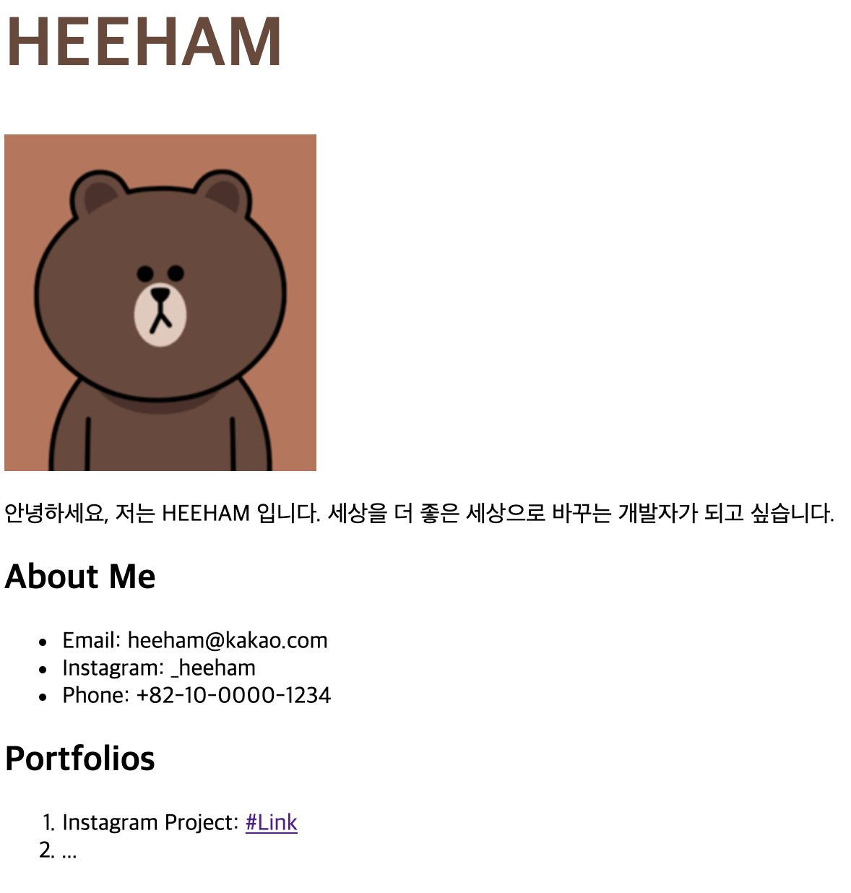
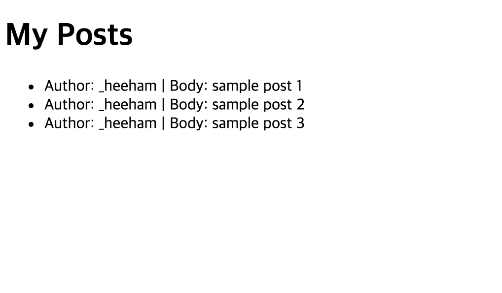

# 멋쟁이사자처럼 직장인 5기 - 하프톤 미션

약 한 달간 배웠던 내용들을 모두 활용하여, 아래의 조건을 모두 만족하는 웹 서비스를 개발해봅니다. 제한시간은 50분입니다.

1. 바탕화면에 my_env 라는 가상환경을 만듭니다.
2. 새롭게 만든 my_env에 Django 개발 환경을 구축합니다.
   - Django 설치
   - PIP 업데이트
3. 이번에 만들 프로젝트는 여러분들의 홈페이지입니다. 새로운 Django Proejct를 만들어주세요.
4. 우리는 VS Code 로 개발합니다. 편리하게 Django 개발을 할 수 있게끔 VS Code 에 Python 세팅을 해주세요.
5. 세팅이 완료되었으면, `resume`, `posts` App 을 만들어주세요.
6. `resume`는 여러분의 메인 랜딩 페이지로 활용할 App 입니다.
   http://localhost:8000/ 으로 접속했을 때, 아래와 같은 페이지를 볼 수 있게끔 개발해주세요. 구체적인 내용과 이미지는 바꿔주시면 됩니다.

   - `resume` App과 관련된 URL Pattern 은 별도의 `urls.py`로 분리해주세요.
   - `Django Template` 을 활용해주세요.
   - `Static` 을 활용해 CSS 파일과 이미지를 추가해주세요.
   - CSS 파일을 기반으로 제목의 색상과 폰트 사이즈를 변경해주세요.
   - Portfolios 에 `posts` 앱과 연동할 링크를 만들어주세요.
     > 해당 링크는 http://localhost:8000/posts/ 로 이동해야 합니다.

   

7. `posts` 앱은 우리가 지금까지 배웠던 `heestagram` 프로젝트와 동일합니다.
   http://localhost:8000/posts/ 으로 접속했을 때, 아래와 같은 페이지를 볼 수 있게끔 개발해주세요. 구체적인 내용은 달라도 좋습니다.

   - `posts` App과 관련된 URL Pattern 은 별도의 `urls.py`로 분리해주세요.
   - `Django Template` 을 활용해주세요.
   - context 에 게시물 데이터를 구성하여 Template 에 전달해주세요.
   - context 를 통해 전달된 게시물이 있는 경우 `for` Loop 을 활용해서 HTML 코드를 재활용하는 형식으로 개발해주세요.

     > context 로 전달된 게시물 정보가 없는 경우에 `게시물이 없습니다.` 와 같은 가이드를 줄 수 있다면 더 좋습니다.

   

---

위 미션을 모두 수행하실 수 있다면, 여러분은 여러 페이지(Static Web Page)로 구성된 완성도 있는 웹 서비스를 개발할 수 있다고 자신하셔도 좋습니다.
